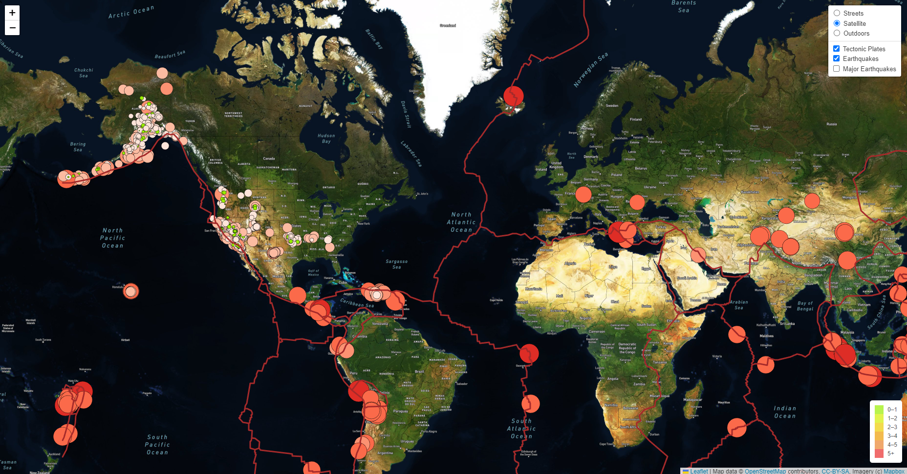

# mapping-earthquakes
Data Analysis Bootcamp - Week 13

## Overview
The purpose of this repository was to learn how to use Javascript and Leaflet to parse GeoJSON files and map all recorded earthquakes over the last 7 days. Additionally, we added tectonic plate boundaries and a separate overlay layer for major earthquakes in order to just view earthquakes with magnitudes 4.5 and up. A preview image of the page we built is shown below.

